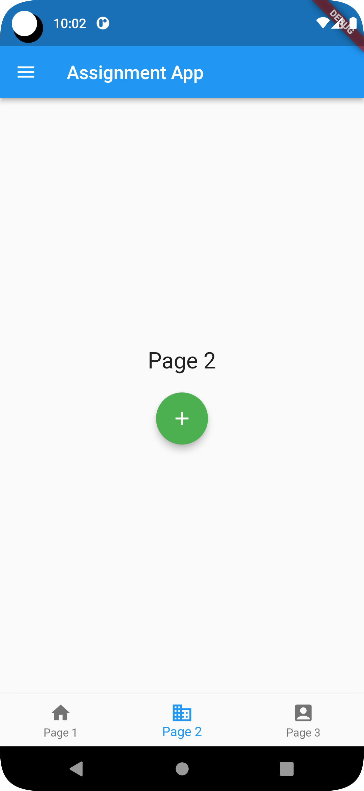
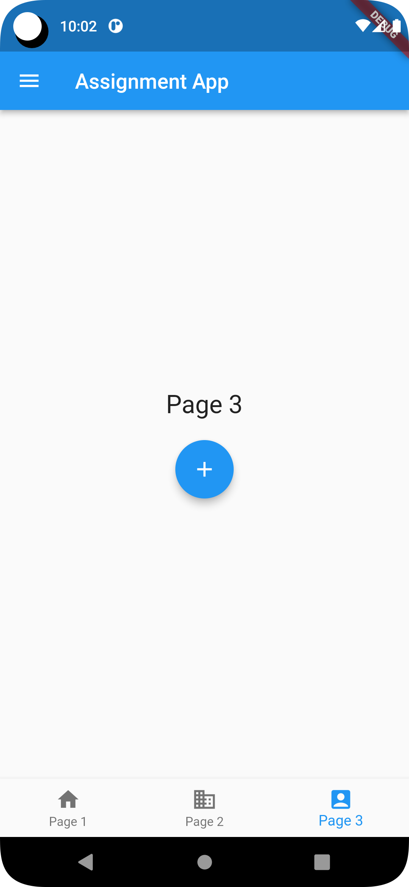

## Project Name

Assignment App

## Description

Ostad Module 05 Assignmnet 


## Screenshots

Add screenshots of your project to showcase its functionality or user interface. You can include up to three screenshots. To add the screenshots, follow the instructions below:

1. **Screenshot 1:** First Page

    

2. **Screenshot 2:** Second Page

    

3. **Screenshot 3:** Third Page

    
   
4. **Screenshot 3:** Drawer Page

    

## Installation


1. Step 1: Clone the repository

    ```
    https://github.com/siraajul/threescreenbottomnavigation
    ```

2. Step 2: Install dependencies

    ```
    flutter pub get
    ```

3. Step 3: Run the project

    ```
    flutter run
    ```

## Instruction

Create a Flutter app with three pages arranged in a tab view screen. Each page will
have a different coloured floating action button and a centred text widget displaying
the page number.
Requirements:
● Use MaterialApp and Scaffold widgets.
● Include an AppBar with a navigation drawer and a bottom navigation tab bar.
● The navigation drawer should allow users to navigate to each page.
● The bottom navigation tab bar should enable users to switch between the
pages.
● Each page should have a unique coloured floating action button.
● Centre a text widget on each page displaying the page number.
● Ensure navigation from the drawer and tab bar leads to the correct pages.
● Use TabBarView and TabBar widgets for tabbed navigation.


Submission:
● Submit 3 screenshots of the app (3 screenshot of 3 pages and 1 screenshot
for drawer)
● Submit github repo link of the complete assignment