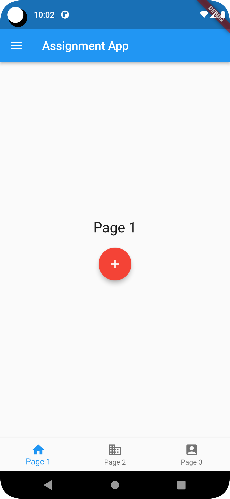

## Project Name

Assignment App

## Description

Ostad Module 05 Assignmnet 

## Screenshots


## Screenshots

Add screenshots of your project to showcase its functionality or user interface. You can include up to three screenshots. To add the screenshots, follow the instructions below:

1. **Screenshot 1:** Describe the content or purpose of the first screenshot and insert it here.

    

2. **Screenshot 2:** Describe the content or purpose of the second screenshot and insert it here.

    

3. **Screenshot 3:** Describe the content or purpose of the third screenshot and insert it here.

    

## Installation


1. Step 1: Clone the repository

    ```
    https://github.com/siraajul/threescreenbottomnavigation
    ```

2. Step 2: Install dependencies

    ```
    flutter pub get
    ```

3. Step 3: Run the project

    ```
    flutter run
    ```

